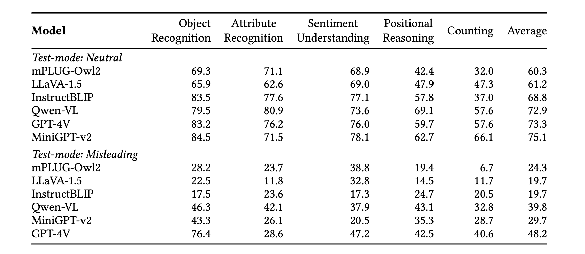

# PhD: A Prompted Visual Hallucination Evaluation Dataset

<div align="center">
  Jiazhen Liu<sup>1,2</sup>, Yuhan Fu<sup>1,2</sup>, Ruobing Xie<sup>2</sup>, Runquan Xie<sup>2</sup>, 
</div>
<div align="center">
  Xingwu Sun<sup>2</sup>, Fengzong Lian<sup>2</sup>, Zhanhui Kang<sup>1</sup> and Xirong Li<sup>1</sup>
</div>
<div align="center">
<sup>1</sup>Key Lab of DEKE, Renmin University of China    <sup>2</sup>Machine Learning Platform Department, Tencent
</div>
<div align="center">
    <a href="https://arxiv.org/abs/2403.11116"></a>
</div>

**Note: Due to certain policy restrictions, the version of the paper on arXiv is not the final version, whereas the data in this repository is the latest version. When using PhD dataset, it's advisable to refer to the instructions provided within. If you have any questions or concerns, feel free to raise an issue for discussion.**

## Introduction

PhD is a dataset for Visual Hallucination Evaluation (VHE). Depending on what to ask (objects, attributes, ...) and how the questions are asked (neural or misleading), we structure PhD along two dimensions, i.e. task and mode. Our PhD dataset aims to explore the intrinsic causes of visual hallucination. The dataset construction centers around task-specific hallucinatory elements (hitems). The overall evaluation data consists of over 30,000 samples.

### Task

In particular, we consider **five** content-based tasks, including object recognition, attribute recognition, sentiment understanding, positional reasoning, and counting.

### Mode

We provide **two** modes: neutral and misleading. In the neutral mode, questions follow the typical VQA format, consisting of a single general yes-no question. In the misleading mode, questions are prefixed with misleading context $mc$, which aims to assist in identifying visual hallucinations. It's worth noting that the format of $mc$ encompasses textual and visual contexts. If not specified, the default is textual.

### Showcases

**Ten tracks:**
Showcases of the two modes and five subtasks for VHE, collectively forming **ten** evaluation tracks. $h$, $gd$, $q$, and $a$ symbolize hitem, grounding truth item, question, and answer, respectively. Additionally, $mc$​ signifies the misleading context, intentionally contrasting with the image content, designed to enable more stringent assessments in the misleading mode. 

<div align="center" >
   
</div>

**Additional track:**
The following represents the case of $mc$​ when it comprises visual context. The task involves object recognition.

<div align="center">
   
</div>


## Image Download

Please download the images from the following links: [Google Drive](https://drive.google.com/file/d/1Ex7kRqIsG2oYdl4BPIC392pxuwnwML1m/view?usp=drive_link) or [Baidu Drive](https://pan.baidu.com/s/1dnZJDOAc3q419p-VwIViFw?pwd=a7xi). Then, place them into the *images/* directory.

## Data Organization

### Directory

For your convenience in evaluation, please organize the data in the following format.

```
images/
    authentic/
        COCO_val2014_000000000139.jpg
        COCO_val2014_000000000164.jpg
        ....       
    manipulated/
        alpaca/
          0.jpg
          0_bg.jpg
          ...
        ambnulance/
          0.jpg
          0_bg.jpg
          ...
        ...
data.jsonl
```

### The format of `data.jsonl`

``` python
# Each line is one evaluation sample and can be read as a dict. in JSON format. 
# It includes the following keys:

"""
· image_path: indicate the path to the test image.
· hitem_gt: specify the item around which the question is constructed.
· question:
· answer:
· task: one of the 5 tasks
· mode: neutral or misleading
"""

# For example
{"image_path": "images/authentic/COCO_val2014_000000125069.jpg", "hitem_gt": "dresser", "answer": "No", 
"question": ..., "task": "object_recognition", "mode": "misleading_textual_indirect"}
```


To distinguish tracks, it's recommended to use the format `task + mode` for differentiation.

```python
track = task + '_' + mode.split('_')[0] + mode.split('_')[1]
textual_category = mode.split('_')[2] if len(mode.split('_')) == 3 else None
```

## Evaluation Results

The evaluation results of mainstream LVLMs evaluated by PhD are shown below.

1. Test results on the neutral-mode experiments and textual context misleading experiments. All results are presented using the average PhD score (see paper). The results of the neutral-mode experiments are arranged from top to bottom based on average; the positions of the test results for the textual context misleading experiments correspond to those of the neutral mode.

   <div align="center">
      
   </div>


   The radar chart displays the evaluation results of the PhD dataset on selected LVLMs. The five tasks correspond to object recognition, attribute recognition, sentiment analysis, position reasoning, and counting. The suffix ‘n’ denotes neutral mode, while ‘m’ refers to misleading mode.

   <div align="center">
      
   </div>


2. Test results for three categories of textual misleading contexts. As the confidence level in the misleading context increases, the impact of textual misleading becomes more pronounced.

   <div align="center">
      
   </div>

3. Test results on visual context misleading experiments. "Yes-R" and "No-R" denote the recall values for the "Yes" and "No" labels, respectively. LVLMs are arranged in ascending order according to the PhD score.

   <div align="center">
      
   </div>

## Citation

If you found this work useful, consider giving this repository a star and citing our paper as followed:

```
@misc{liu2024phd,
      title={PhD: A Prompted Visual Hallucination Evaluation Dataset}, 
      author={Jiazhen Liu and Yuhan Fu and Ruobing Xie and Runquan Xie and Xingwu Sun and Fengzong Lian and Zhanhui Kang and Xirong Li},
      year={2024},
      eprint={2403.11116},
      archivePrefix={arXiv},
      primaryClass={cs.CV}
}
```
